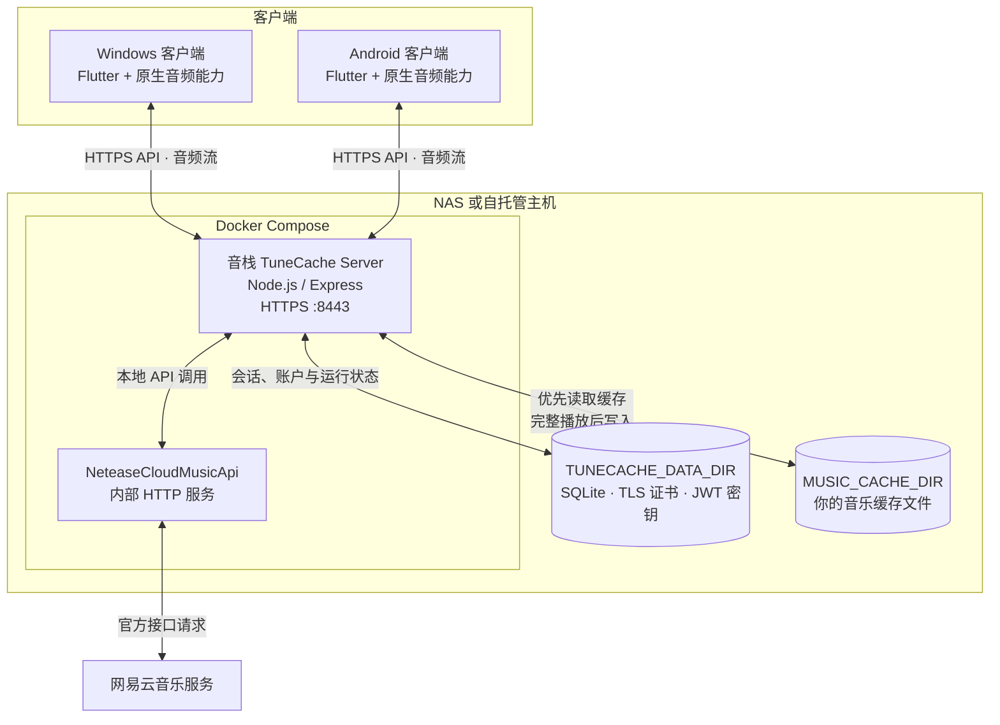

# 音栈 TuneCache

本项目由 AI 驱动。

把音乐缓存到你自己的 NAS 或服务器。音栈 TuneCache 是一个由 Flutter 客户端和自托管服务端组成的个人音乐播放器：歌曲完整播放后会保存到可指定的服务器缓存目录；下次播放优先读取你的 NAS 缓存，未命中时才请求上游资源。客户端支持 Windows 与 Android，Linux 客户端计划中。

> 本项目仅供个人使用。请遵守网易云音乐及相关内容提供方的服务条款、版权规则与适用法律；不会绕过会员、付费、地区或版权限制。

## 功能

- Windows 与 Android 客户端
- 自托管 Docker 服务端，音乐缓存目录可由宿主机指定
- 网易云扫码、短信、手机号密码与邮箱密码登录
- 我的收藏、收藏列表内搜索、收藏与取消收藏
- 歌词、封面、音量、播放队列与顺序／随机／单曲循环
- 已缓存歌曲管理与播放来源提示

## 系统架构



客户端仅连接自托管的音栈 TuneCache Server；服务端优先从 NAS 缓存提供音乐，缓存未命中时才通过内部 API 服务请求上游资源。`TUNECACHE_DATA_DIR` 与 `MUSIC_CACHE_DIR` 均由宿主机挂载持久化，不会包含在 Git 仓库中。

## Docker 部署

要求：Docker Engine 与 Docker Compose Plugin。

```bash
git clone https://github.com/zhinaijiang32/TuneCache tunecache
cd tunecache
cp .env.example .env
# 编辑 .env，至少按需设置 MUSIC_CACHE_DIR
docker compose up -d --build
```

服务默认监听 `https://<服务器地址>:8443`。首次启动会生成自签名证书、SQLite 数据库和持久化 JWT 密钥；它们位于 `TUNECACHE_DATA_DIR`，因此升级或重建容器不会使客户端登录状态失效。

### 指定 NAS 音乐缓存目录

编辑根目录 `.env` 中的 `MUSIC_CACHE_DIR`。该值是 **Docker 宿主机路径**，并会映射到容器内固定的 `/app/data/music`。

```dotenv
# 群晖示例
MUSIC_CACHE_DIR=/volume1/media/tunecache-cache

# 飞牛 / NAS 常见挂载路径示例
# MUSIC_CACHE_DIR=/vol2/music/tunecache-cache
```

修改后更新服务：

```bash
docker compose up -d --build
```

如需让自签名证书包含 NAS 的 IP 或主机名，请在**首次启动前**把 `.env` 中的 `INTERNAL_HOST` 改为该地址。证书生成后会持久化；修改该值后如需重新生成证书，应先备份并删除 `TUNECACHE_DATA_DIR/certs`。

其他持久化数据（数据库、证书、会话签名密钥）使用 `TUNECACHE_DATA_DIR`，默认是仓库下的 `./data`。请不要删除该目录，除非你要清空服务端数据并让所有客户端重新登录。

音乐缓存目录不会在服务启动时扫描，也没有后台轮询任务；只有客户端请求播放、下载列表或删除缓存时才会访问缓存盘。没有客户端请求时，缓存盘不会被服务端读取。

> 为兼容旧部署，Compose 仍支持 `FNMUSIC_PORT` 与 `FNMUSIC_DATA_DIR`；新的 `TUNECACHE_PORT` 与 `TUNECACHE_DATA_DIR` 会优先生效。

## 客户端构建

```bash
cd client
flutter pub get

# Windows
flutter build windows --release \
  --dart-define=TUNECACHE_SERVER_HOST=192.168.1.10 \
  --dart-define=TUNECACHE_SERVER_PORT=8443

# Android
flutter build apk --release \
  --dart-define=TUNECACHE_SERVER_HOST=192.168.1.10 \
  --dart-define=TUNECACHE_SERVER_PORT=8443
```

默认使用 HTTPS。服务端默认自签名证书；音栈 TuneCache 客户端会信任当前配置的服务端地址。不要把服务直接暴露到不受信任的公网；如需公网访问，请在反向代理上配置受信任 TLS 证书和访问控制。

## 目录说明

```text
client/   Flutter Windows / Android 客户端
server/   Node.js 服务端及 Dockerfile
data/     Docker 运行时数据（自动生成，不提交 Git）
```

## 许可证

本项目采用 [MIT License](LICENSE)。详见仓库根目录的 [LICENSE](LICENSE) 文件。

## 第三方开源项目

音栈 TuneCache 由下列开源项目提供运行时能力；衷心感谢各项目的维护者与贡献者。

### 客户端

- [Flutter](https://github.com/flutter/flutter)：跨平台客户端框架。
- [Riverpod](https://github.com/rrousselGit/riverpod)：状态管理。
- [Dio](https://github.com/cfug/dio)：HTTP 客户端。
- [media_kit](https://github.com/media-kit/media-kit)：跨平台音频播放。
- [cached_network_image](https://github.com/Baseflow/flutter_cached_network_image)：网络图片缓存。
- [flutter_secure_storage](https://github.com/juliansteenbakker/flutter_secure_storage)：安全会话存储。
- [qr_flutter](https://github.com/theyakka/qr.flutter)：二维码渲染。

### 服务端

- [NeteaseCloudMusicApi](https://github.com/Binaryify/NeteaseCloudMusicApi)：网易云音乐 API 服务。原项目已停止维护，后续计划迁移至可维护替代方案。
- [Express](https://github.com/expressjs/express)：Node.js Web 框架。
- [Axios](https://github.com/axios/axios)：HTTP 请求客户端。
- [better-sqlite3](https://github.com/WiseLibs/better-sqlite3)：SQLite 数据库驱动。
- [jsonwebtoken](https://github.com/auth0/node-jsonwebtoken)：JWT 会话签名与校验。
- [dotenv](https://github.com/motdotla/dotenv)、[Helmet](https://github.com/helmetjs/helmet)、[cors](https://github.com/expressjs/cors)、[morgan](https://github.com/expressjs/morgan) 与 [express-rate-limit](https://github.com/express-rate-limit/express-rate-limit)：服务端配置、安全、日志与限流。

完整的直接依赖版本以 [client/pubspec.yaml](client/pubspec.yaml) 与 [server/package.json](server/package.json) 为准；间接依赖由对应的锁定文件管理。
