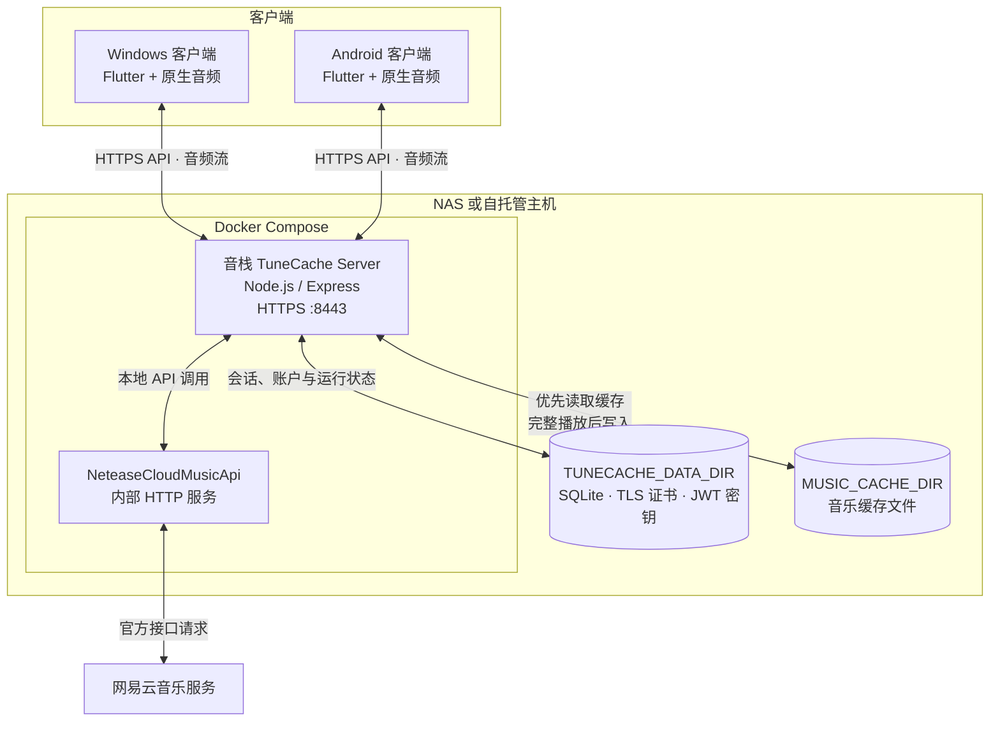

# 音栈 TuneCache

把音乐缓存到你自己的 NAS 或服务器。

音栈 TuneCache 是一个由 Flutter 客户端和自托管服务端组成的个人音乐播放器。歌曲完整播放后会保存到可指定的服务器缓存目录；下次播放优先读取你的 NAS 缓存，未命中时才请求上游资源。

> 本项目仅供个人使用。请遵守网易云音乐及相关内容提供方的服务条款、版权规则与适用法律；不会绕过会员、付费、地区或版权限制。

## 功能

- Windows 与 Android 客户端
- 自托管 Docker 服务端，音乐缓存目录可由宿主机指定
- 网易云扫码、短信、手机号密码与邮箱密码登录
- 我的收藏、收藏列表内搜索、收藏与取消收藏
- 歌词、封面、音量、播放队列与顺序／随机／单曲循环
- 已缓存歌曲管理与播放来源提示

## 系统架构



## Docker 部署

要求：Docker Engine 和 Docker Compose Plugin。

```bash
git clone https://github.com/zhinaijiang32/TuneCache tunecache
cd tunecache
cp .env.example .env
# 编辑 .env，按需要设置 MUSIC_CACHE_DIR
docker compose up -d --build
```

服务默认监听 `https://<服务器地址>:8443`。首次启动会生成自签名证书、SQLite 数据库和持久化 JWT 密钥；它们位于 `TUNECACHE_DATA_DIR`，因此升级或重建容器不会使客户端登录状态失效。

### 指定 NAS 音乐缓存目录

编辑根目录 `.env` 的 `MUSIC_CACHE_DIR`。该值是 Docker 宿主机路径，并会映射为容器内的 `/app/data/music`。

```dotenv
# 群晖示例
MUSIC_CACHE_DIR=/volume1/media/tunecache-cache

# 飞牛 / NAS 示例
# MUSIC_CACHE_DIR=/vol2/music/tunecache-cache
```

更新服务：

```bash
docker compose up -d --build
```

缓存目录不会在服务启动时扫描，也没有后台轮询任务；仅在客户端请求播放、查看已下载或删除缓存时访问磁盘。

## 客户端构建

```bash
cd client
flutter pub get

# Windows
flutter build windows --release \
  --dart-define=TUNECACHE_SERVER_HOST=192.168.1.10 \
  --dart-define=TUNECACHE_SERVER_PORT=8443

# Android
flutter build apk --release \
  --dart-define=TUNECACHE_SERVER_HOST=192.168.1.10 \
  --dart-define=TUNECACHE_SERVER_PORT=8443
```

默认使用 HTTPS 与自签名证书。不要直接向不受信任的公网暴露服务；公网使用时，请在反向代理上配置受信任 TLS 证书和访问控制。

## 目录

```text
client/   Flutter Windows / Android 客户端
server/   Node.js 服务端与 Dockerfile
data/     Docker 运行数据（自动生成，不提交 Git）
```

## 许可证

本项目采用 [MIT License](LICENSE)。

## 第三方开源项目

音栈 TuneCache 使用以下项目：

- [Flutter](https://github.com/flutter/flutter)
- [Riverpod](https://github.com/rrousselGit/riverpod)
- [Dio](https://github.com/cfug/dio)
- [media_kit](https://github.com/media-kit/media-kit)
- [cached_network_image](https://github.com/Baseflow/flutter_cached_network_image)
- [flutter_secure_storage](https://github.com/juliansteenbakker/flutter_secure_storage)
- [qr_flutter](https://github.com/theyakka/qr.flutter)
- [NeteaseCloudMusicApi](https://github.com/Binaryify/NeteaseCloudMusicApi)
- [Express](https://github.com/expressjs/express)
- [Axios](https://github.com/axios/axios)
- [better-sqlite3](https://github.com/WiseLibs/better-sqlite3)
- [jsonwebtoken](https://github.com/auth0/node-jsonwebtoken)
- [dotenv](https://github.com/motdotla/dotenv)、[Helmet](https://github.com/helmetjs/helmet)、[cors](https://github.com/expressjs/cors)、[morgan](https://github.com/expressjs/morgan) 与 [express-rate-limit](https://github.com/express-rate-limit/express-rate-limit)

完整直接依赖版本以 [client/pubspec.yaml](client/pubspec.yaml) 和 [server/package.json](server/package.json) 为准。
